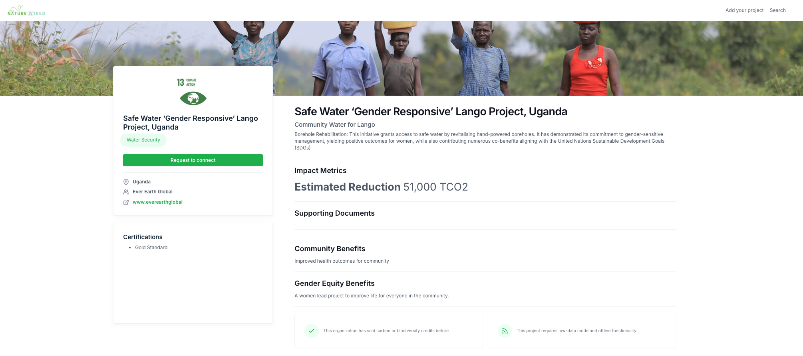
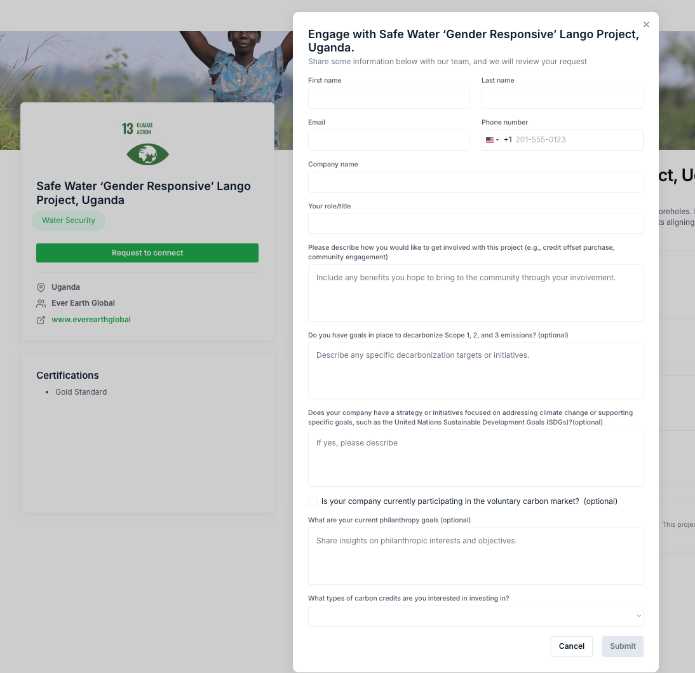
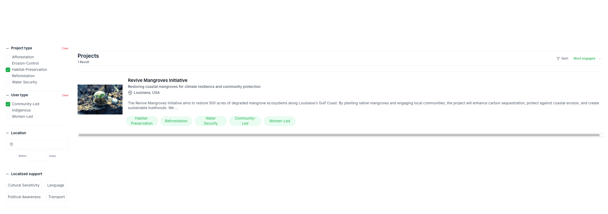
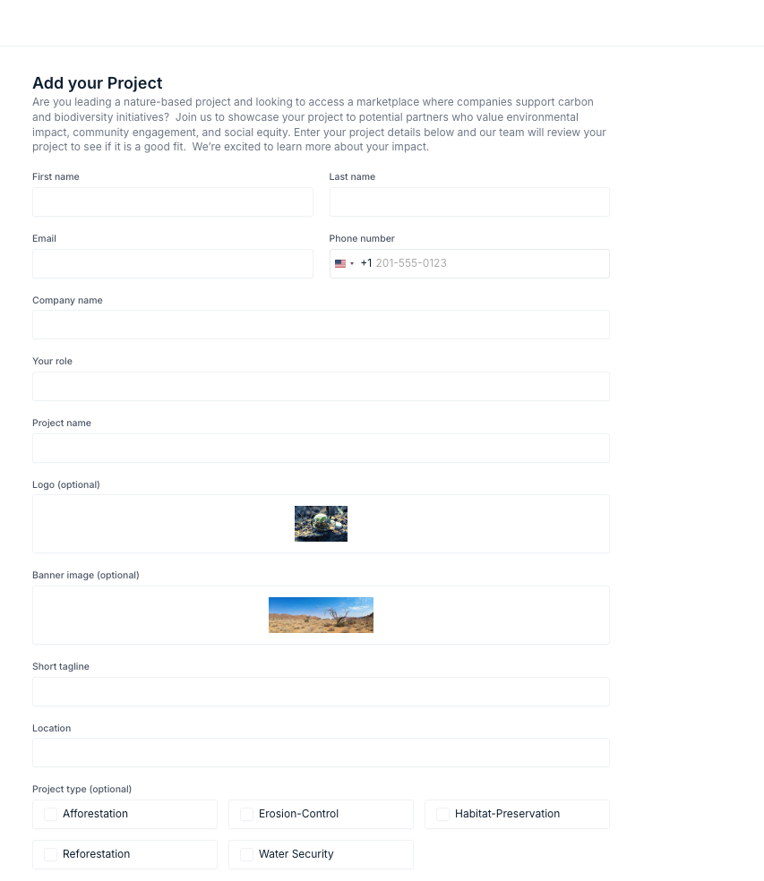
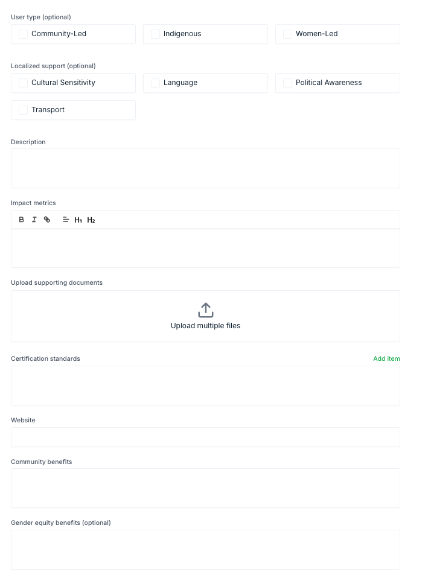
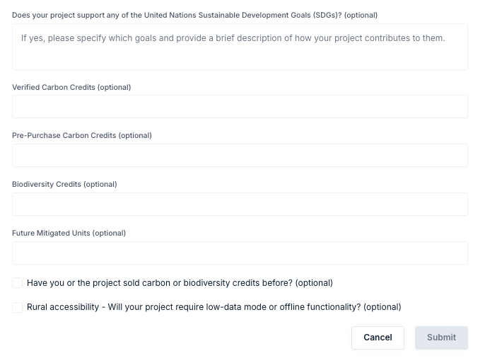
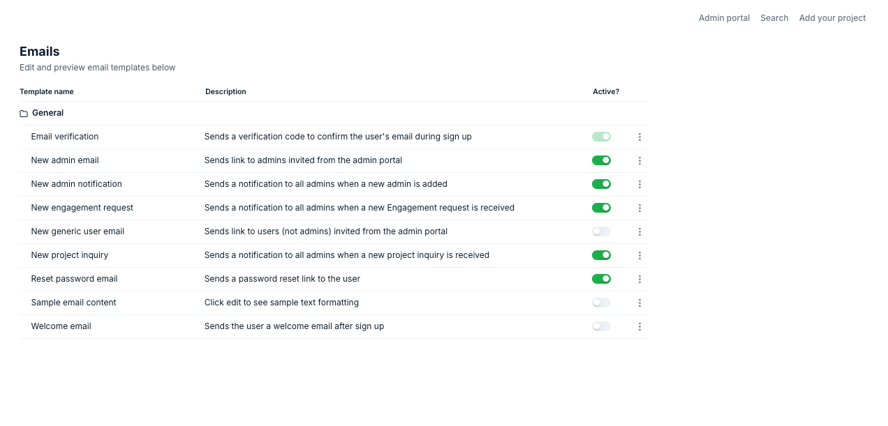
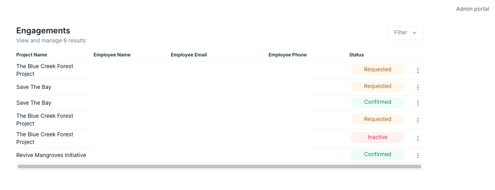
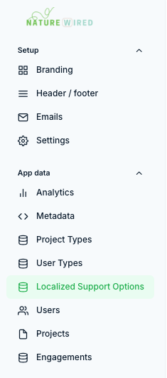

# Credit Harbor Marketplace

## Introduction
Credit Harbor is a two-way marketplace developed by **Nature Wired** to connect corporate buyers with verified carbon and biodiversity credits from high-impact nature-based projects.  Built on **Bubble.io**, a no-code platform, Credit Harbor simplifies the process of discovering, verifying, and transacting environmental credits. In the initial phase, we have built an MVP web application that can facilitate project discovery and connection, with manual curation from the Nature Wired admin team.

## Features & Screenshots

### 1. **Marketplace for Carbon & Biodiversity Credits**
- Corporate buyers can browse project listings and request to connect.
- Filters for project type, location, and impact metrics.
- Inquiry form is sent via email to admin team for review.
- Sender automatically receives an email confirmation message of request.
- Nature Wired admin team can reach out directly (off-platform). 

 – The main marketplace page where buyers browse projects.

 – When a buyer clicks on a project, sees details, and clicks to connect.

 - The form buyers fill out to submit an inquiry.

 - The search and filtering options available to buyers.

### 2. **Project Onboarding and Verification**
- Project developers can fill in a new nature-based project inquiry form.
- Inquiry form is sent via email to admin team for review.
- Sender automatically receives confirmation message of request.
- Nature Wired admin team can reach out directly (off-platform).

 = The form project developers fill out and submit.

### 3. **Admin Dashboard**
- Admin portal centrally manages settings and data for the app.
- Nature Wired Admins can manage their personal profile and settings.
- **User tab** - app admin details.
- **Project tab** - full listing of projects and status "Pending Review", "Active", "Inactive".
- **Engagements tab** - full list of engagements and status "Requested", "Confirmed", "Inactive".

 – Screenshots of the email templates used in the platform.

 – Projects listed with statuses like Pending, Active, etc.

 – Engagements listed with statuses like Requested, Confirmed, Inactive.

 – The admin functions available in the dashboard.

### 4. **Tokenization & Transactions**
- Future exploration of integration with **Hedera Managed Guardian Service (MGS)** for tokenized credits.
- Researching feasibility for transparent, immutable record-keeping for transactions.

## Tech Stack & Platform
- **Frontend & Workflows:** Built using **Bubble.io** (No-code platform).
- **API Integrations:** Currently researching the feasibility of integrating **Hedera’s Managed Guardian Service (MGS)** for tokenization, verification, and reporting.
- **Hosting & Deployment:** Managed within Bubble.io.
- **Accessibility:** The app is web-based and accessible from any modern browser across devices. It is not currently a native mobile app in the Apple/Android stores.
- **Development Partner:** Credit Harbor was built as a joint effort with **Airdev.io**, a no-code software development agency specializing in building custom web applications using the Bubble platform. Airdev serves clients ranging from startups to Fortune 500 enterprises.

## Deployment & Maintenance
- Hosted and maintained on **Bubble.io**.
- Admin access through Bubble’s built-in management interface.
- Regular updates planned to enhance functionality and user experience.

## API & Future Integrations
- **MGS API Integration:** Researching feasibility for onboarding, verification, tokenization, and credit transaction tracking.
- **Potential AI-driven impact reporting** for credit buyers.
- **Scaling to include direct project investment opportunities** beyond carbon credits.

## API & Future Integrations
- **MGS API Integration:** Onboarding, verification, tokenization, and credit transaction tracking.
- **Potential AI-driven impact reporting** for credit buyers.
- **Scaling to include direct project investment opportunities** beyond carbon credits.
- **Virtual Reality** VR immersive experiences of nature-based projects for corporations, employees and other stakeholders.

## Contributing & Contact
While **Credit Harbor** is built using a no-code approach, we welcome collaboration for API integrations and feature enhancements. For more information:
- Contact: [hello@naturewired.earth]
- Website: [https://creditharbor.naturewired.earth](https://creditharbor.naturewired.earth)

---

**Disclaimer:** Credit Harbor is in its MVP stage and continuously evolving. Projects currently listed are for reference purposes only. Features will continue to be updated with feedback and as we integrate with blockchain-based verification solutions.
